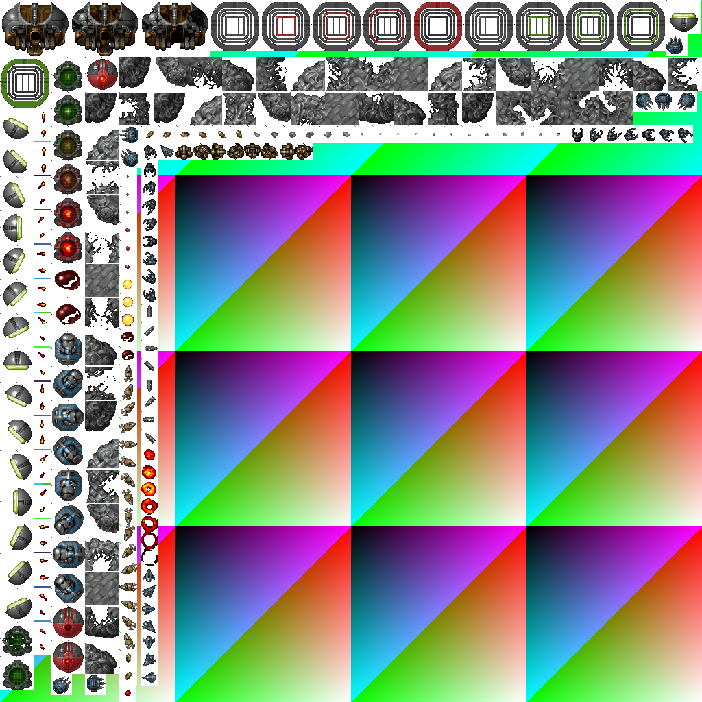
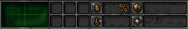
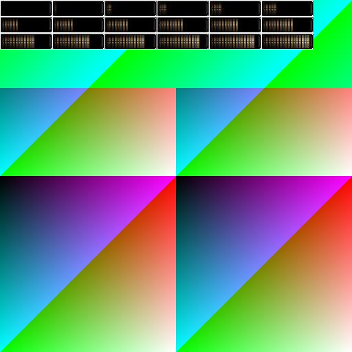

# LostGarden Graphics

Daniel Cook (http://www.lostgarden.com/) provides a nice set of graphics to get indy developers started.

In true artists style the naming and layout of the files is a true mess.

This is a cleaned up version, which might be of help to you ... or it may not.

**Important:** This repository only repackages and reorganizes Daniel Cook's freely-licensed artwork. I claim no ownership or rights to any of the artwork—all credit belongs to Daniel Cook. See [CREDITS](CREDITS) for full details.

## License

**[Creative Commons Attribution 3.0](https://lostgarden.com/2007/03/15/lost-garden-license/)** by Daniel Cook

See [LICENSE](LICENSE) and [CREDITS](CREDITS) files for complete terms and attribution requirements.

## Bundles

### Iron Plague (Sinistar)
"[Iron Plague (Sinistar)](https://lostgarden.com/2005/03/30/download-a-complete-set-of-sweet-8-bit-sinistar-clone-graphics/)" art by Daniel Cook (Lostgarden.com)

Work in progress!
Might change at any time.

I only work on this around 15 minutes every day during my lunchbreaks,
so it might take a while until it's finished.

And yes, in some cases the cut could be much tighter, but I want to get through all of them once
before I start to optimize.

#### Preview

**Main Sprite Atlas** (1024x1024):

**Interface Elements - Opaque** (512x512):

**Interface Elements - Transparent** (512x512):

